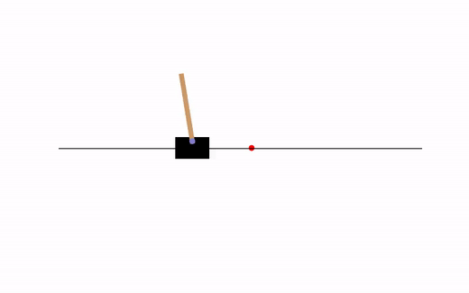

# Control library
This repository implements both the canonical systems in control theory and algorithms for controlling them.\
The library is currently quite minimalist, but will expand to include more systems and algorithms in the near future.

## Canonical systems
- [x] CartPole
- [ ] Acrobot

## Control algorithms
- [x] LQR (Linear Quadratic Regulator).

## Requirements
- python=3.7.7
- numpy=1.18.2
- scipy=1.4.1
- matplotlib=3.0.2

## Usage
```bash
python lqr_cartpole.py
```

### Demo:
LQR CartPole|
-----------------------|
Random initial conditions and random goal.|
|

## References:
- Steve Brunton's [Control Bootcamp](https://www.youtube.com/playlist?list=PLMrJAkhIeNNR20Mz-VpzgfQs5zrYi085m) YouTube lecture series.
- Mark Wilfried Mueller's [implementation of LQR in Python](https://www.mwm.im/lqr-controllers-with-python/).
- Russ Tedrake's [Underactuated Robotics](http://underactuated.csail.mit.edu/) course at MIT.
